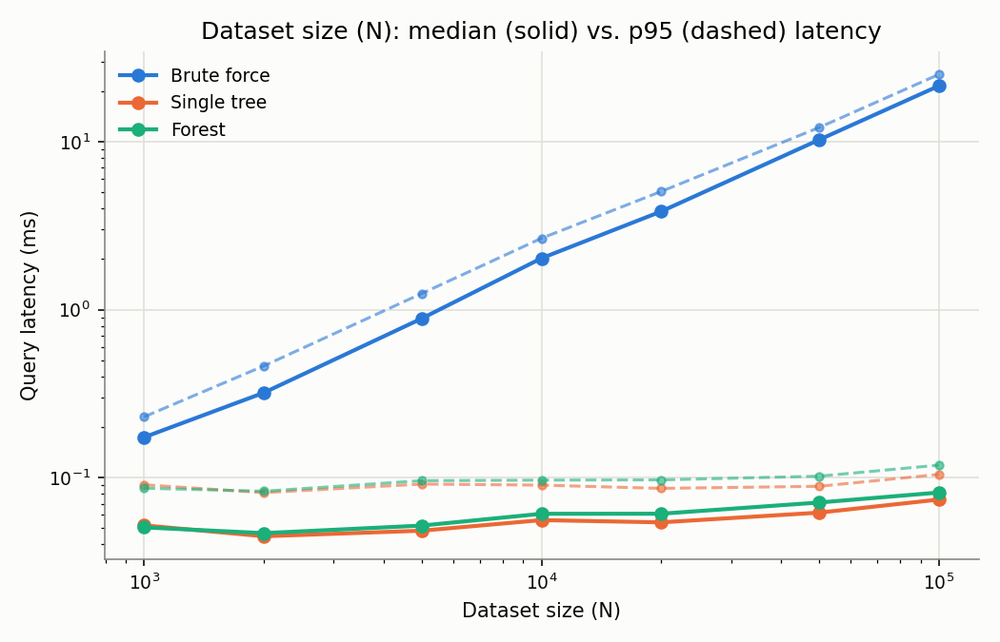
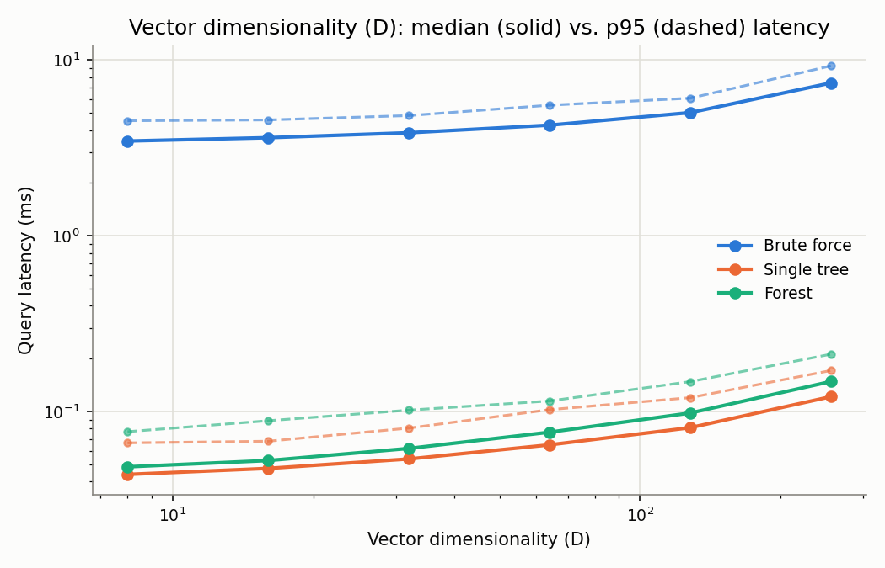
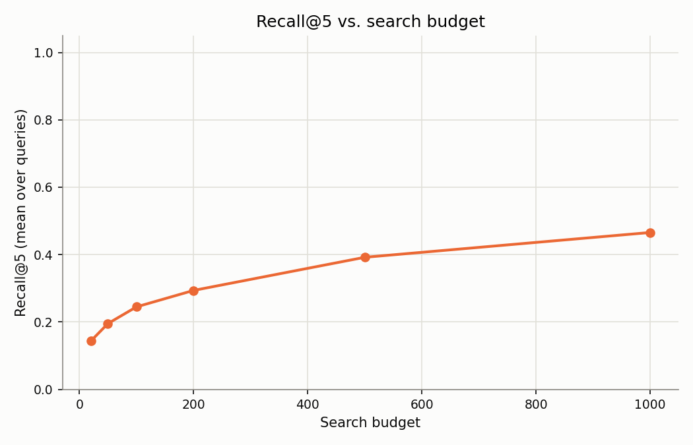
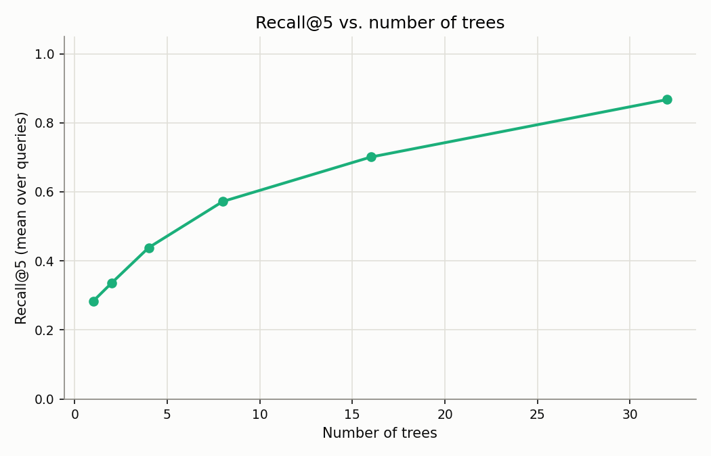

# rpforest-ann

Random Projection Forest for Approximate Nearest Neighbor (ANN) search, implemented from first principles in C.

## Status

Phase 1 complete: vector/dataset representation and synthetic dataset generation, verified through tests.
Phase 2 complete: random projection tree, hyperplane splits, recursive build and leaf buckets. 
Phase 3 complete: margin-based priority-queue search over a single tree.
Phase 4 complete: forest of independently-seeded trees, shared priority-queue search across all of them.
Phase 5 complete: Brute-force baseline + recall@k measurement.
Phase 6 complete: benchmark harness (latency vs. N and dimensionality, recall@5 vs. search_budget and num_trees) + results.

## Motivation

Implemented while studying the ideas behind Spotify's [Annoy](https://github.com/spotify/annoy) library.

## Build

```
make
./build/rpforest-ann
```

## Approach

### Data representation

A vector is D floats stored next to each other in memory. A dataset of N vectors is one single block of N * D floats, not N seperate allocations. This facilitates leaf-bucket scans and brute-force baseline when reading many consequetive vectors. Dimentionality D is set at runtime for easier comparison of different dimentionalities later on.

### Synthetic dataset generation

Real MFCC audio features were not available, so the project imitates this data with the generation of synthetic vectors with identical stattistical shape.

Each generatedd vector starts from a small number of shared random values, called latent factors. Every output dimention is built as a weighted combination of those same factors plus its own independent noise. Because different dimentions share the same factors, they end up correlated with each other, similar to how real dimensions usually are.

The dimensions also do not all carry the same amount of signal: later dimensions are given smaller variance, following the way real MFCC coefficients shrink in magnitude further down the coefficient index.

### Random projection tree

Each tree recursively partitions the dataset with random hyperplane splits on the equidistant of two randomly chosen points of each internal node's set. Every point goes to the closest pivot, distributing the points of the dataset in two spaces accordingly. This reduces algebraically to a single dot product and threshold comparison per point, the same approach used by Annoy. Recursion stops either once a node's point count drops to a fixed leaf sixe or a maximum depth is reached.

Verified against two properties, partition correctness (every point ends up in exactly one leaf) and split self-consistency (independently re-applying the tree's own split rule from the root agrees with were each point was actually placed).

### Search on single tree

A query descends one tree using dot product and threshold tests from the tree's creation, always continuing into the side the query falls on. Whenever a split is passed, instead of dicarding the non-taken side, it is pushed onto a priority queue with a priority equal to the smallest _margin_ (distance from split's threshold) seen anywhere along the path so far.
- A large margin means the decision was confident, so that untaken side stays low priority.
- A small margin means the decision was close and worth revisiting later.

The descend continues from the best entry left in the queue once a leaf is reached, collecting candidate points from every leaf visited, until either: a set _search budget_ of candidates has been collected or the queue runs out. Every collected candidate is scored by its actual distance to the query and the closest k are returned.

Verified with three checks: querying with a point already in the dataset always returns that same point as its own nearest neighbor at distance 0, returned results come back sorted by distance, and, over 50 fresh query points compared against an exact brute-force search, the tree matched about 61% of the true nearest 5 neighbors with a search budget covering 10% of the dataset. A single tree finding a majority but not all of the true neighbors at that budget is expected, this is exactly what combining multiple trees is meant to improve on.

### Random projection forest

A forest is a fixed number of trees built independently over the same dataset, each with its own seed. Trees disagree with each other mostly where a single tree's split was a close call, a point sitting near one tree's boundary usually lands cleanly inside a leaf in most of the others.

Searching the forest starrts every tree's own descent at once instead of running one tree's search after another. Each tree still follows the single-tree rule of continuing into whicheveer side the query falls on, but instead of walking straight into a leaf it pushes the side it did not take onto one priority queue shared by every tree, using the same minimum margin priority as the single tree search. Once every tree has reached a first leaf this way, the search keeps pulling the best entry out of that shared queue, whichever tree it came from, until either the search budget is spent or the queue is empty. Every tree competes for the same fixed budget instead of getting an even, tree-blind split of it.

### Brute force baseline and recall@k

The tree and forest search only look at a part of the dataset, so their results can miss some of the actual nearest points. To measure how often that happens, a brute force search was implemented as reference: it checks every point in the dataset and returns the true closest k. This implementation is much slower with a O(nlogn) time complexity but it produces the most accurate result.

Recall@k compares an approximate result, from the tree or the forest, against this ground truth. It is a fraction of the true k nearest points that the approximate search actually found. A recall@5 of 0.8 means 4 out of the true 5 nearest points were returned.

### Benchmark harness

Every earlier phase's numbers came from one dataset of a fixed size. A benchmark (`scripts/benchmark.c`, run with `make bench`) measures how latency and recall actually change as the problem grows.

For a range of dataset sizes N and vector dimensionalities D, brute force, a single tree, and the forest are each timed against the same 250 held-out query vectors, generated from the same distribution as the dataset but never inserted into it. Seperately, recall@5 is measured across a range of search_budget values for the single tree, and a range of num_trees for the forest. Timing uses `clock_gettime(CLOCK_MONOTONIC, ...)`, with an untimed warm-up before each timed run so CPU frequency scaling and cold caches don't bias the first measurements.

## Results



Brute force's query latency grows in proportion to N, from 0.17 ms at N=1,000 to 21.5 ms at N=100,000. Single tree and forest search both stay in the 0.05-0.08 ms range across the same span, barely moving. This is the seperation the tree/forest design produces.



Dimensionality has a much smaller effect: all three methods get somewhat slower as D grows from 8 to 256, brute force considerably more, but unlike the gap seen across N.





Recall@5 rises with both search_budget (single tree) and num_trees (forest), with diminishing returns past a point in both cases. These curves were measured on a larger, higher dimensional dataset (N=20,000, dim=32) than the recall@5 figures quoted above (N=2,000, dim=20), so the two aren't directly comparable, a harder search problem naturally recalls less at the same budget or tree count.

## Sources

- Erik Bernhardsson, "Nearest neighbor methods and vector models", [part 1](https://erikbern.com/2015/09/24/nearest-neighbor-methods-vector-models-part-1.html) and [part 2](https://erikbern.com/2015/10/01/nearest-neighbors-and-vector-models-part-2-how-to-search-in-high-dimensional-spaces.html)
- Dasgupta and Freund, ["Random projection trees and low dimensional manifolds"](https://cseweb.ucsd.edu/~dasgupta/papers/rptree-stoc.pdf) (STOC 2008)
- [spotify/annoy](https://github.com/spotify/annoy)
- [MFCC tutorial](http://practicalcryptography.com/miscellaneous/machine-learning/guide-mel-frequency-cepstral-coefficients-mfccs/), Practical Cryptography
- [Box-Muller transform](https://en.wikipedia.org/wiki/Box%E2%80%93Muller_transform), Wikipedia
- [Factor analysis](https://en.wikipedia.org/wiki/Factor_analysis), Wikipedia
- Beis and Lowe, ["Shape Indexing Using Approximate Nearest-Neighbour Search in High-Dimensional Spaces"](https://www.cs.ubc.ca/~lowe/papers/cvpr97.pdf) (CVPR 1997)
- Melissa O'Neill, ["PCG, A Family of Better Random Number Generators"](https://www.pcg-random.org/)
- Aumüller, Bernhardsson, and Faithfull, ["ANN-Benchmarks: A Benchmarking Tool for Approximate Nearest Neighbor Algorithms"](https://arxiv.org/abs/1807.05614)
- Gil Tene, ["How NOT to Measure Latency"](https://www.youtube.com/watch?v=lJ8ydIuPFeU)
- Chandler Carruth, ["Tuning C++: Benchmarks, and CPUs, and Compilers! Oh My!"](https://www.youtube.com/watch?v=nXaxk27zwlk) (CppCon 2015)

## License

MIT. See [LICENSE](LICENSE).
